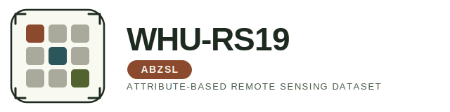

<p align="center">
  
</p>

<h3 align="center">An Attribute-Based Dataset for Remote Sensing Image Understanding</h3>

<p align="center">
  <a href="https://www.mdpi.com/2072-4292/17/14/2384">
    
  </a>
  <a href="https://doi.org/10.3390/rs17142384">
    
  </a>
  
  
</p>

<p align="center">
  Balestra, M., Paolanti, M., &amp; Pierdicca, R. (2025). <i>WHU-RS19 ABZSL: An attribute-based dataset for remote sensing image understanding.</i> Remote Sensing, 17(14), 2384.<br>
  <a href="https://doi.org/10.3390/rs17142384">doi.org/10.3390/rs17142384</a>
</p>

---

## Abstract

Most aerial-scene benchmarks assign one class label per image, which cannot capture the multiple, overlapping elements that make up a real scene. **WHU-RS19 ABZSL** re-annotates all 1,005 images of the classic WHU-RS19 benchmark with a dense, image-level vector of **38 semantic attributes** — objects, geometric patterns, and dominant colours — produced by six trained annotators and validated through a three-stage consensus and expert-review pipeline. Five backbones (ResNet-18, VGG-16, InceptionV3, EfficientNet-B0, ViT-B/16) were fine-tuned for multi-label attribute prediction, reaching macro-F1 scores between **0.7385** and **0.7608**. EfficientNet-B0 and ViT-B/16 lead overall, while low-frequency or visually ambiguous attributes (e.g. *Ochre*, *Triangle*, *Orange*) remain the hardest to learn for every architecture. The dataset targets multi-label classification, explainable AI, semantic retrieval, and attribute-based zero-shot learning in remote sensing.

## Dataset at a glance

| | |
|---|---|
| Images | 1,005 (600 × 600 px, sourced from Google Earth) |
| Scene categories | 19 |
| Attributes | 38 total — 19 objects · 11 dominant colours · 8 geometric patterns |
| Annotators | 6 domain experts + supervisor review + final expert QA (3-stage pipeline) |
| Split | 70 / 30 stratified train/test → 702 / 303 images |

## Attribute taxonomy

Frequency column shows how common each attribute is across the 1,005 images: `●●●` common · `●●` moderate · `●` rare.

<details open>
<summary><b>Objects (19)</b></summary>

| Attribute | Frequency |
|---|---|
| Soil | ●●● |
| Grass | ●●● |
| Trees | ●●● |
| Road | ●●● |
| Road Transport | ●●● |
| Buildings | ●● |
| Parking Spots | ●● |
| Water | ●● |
| Bridge | ●● |
| Houses | ●● |
| Water Transport | ● |
| Dock | ● |
| Rails | ● |
| Trains | ● |
| Stadium | ● |
| Airplane | ● |
| Mountains | ● |
| Sand | ● |
| Football Field | ● |

</details>

<details open>
<summary><b>Dominant colours (11)</b></summary>

| Attribute | Frequency |
|---|---|
| Gray | ●●● |
| Brown | ●●● |
| Green | ●●● |
| White | ●●● |
| Blue | ●●● |
| Beige | ●●● |
| Light Blue | ●● |
| Black | ●● |
| Red | ●● |
| Orange | ● |
| Ochre | ● |

</details>

<details open>
<summary><b>Geometric patterns (8)</b></summary>

| Attribute | Frequency |
|---|---|
| Rectangle | ●●● |
| Curve | ●●● |
| Line | ●● |
| Closed Curve | ●● |
| Dashed Line | ●● |
| Sine Wave | ●● |
| Square | ●● |
| Triangle | ● |

</details>

## Baseline results

Multi-label attribute classification, ImageNet-pretrained backbones fine-tuned for 50 epochs (Adam, lr 1×10⁻⁴, batch size 32, BCE loss, sigmoid output).

| Model | Input size | Macro F1-score |
|---|---|---|
| ResNet-18 | 224×224 | 0.7385 |
| VGG-16 | 224×224 | 0.7458 |
| InceptionV3 | 299×299 | 0.7465 |
| ViT-B/16 | 224×224 | 0.7594 |
| **EfficientNet-B0** | 224×224 | **0.7608** ⭐ |

Common attributes (Soil, Gray, Trees) reach F1 ≈ 0.95–0.98 across every model; rare or visually ambiguous ones (Ochre, Triangle, Orange) collapse toward F1 ≈ 0.00 — confirming that class imbalance, not architecture, is the main bottleneck. Full per-attribute precision/recall/F1 tables and confusion matrices are in the paper.

## Categories & train/test split

<details>
<summary>Show all 19 scene categories</summary>

| Category | Total | Train | Test |
|---|---|---|---|
| Airport | 52 | 37 | 15 |
| Beach | 54 | 38 | 16 |
| Bridge | 52 | 36 | 16 |
| Commercial | 52 | 37 | 15 |
| Desert | 54 | 38 | 16 |
| Farmland | 52 | 37 | 15 |
| Football Field | 54 | 38 | 16 |
| Forest | 52 | 37 | 15 |
| Industrial | 52 | 37 | 15 |
| Meadow | 52 | 37 | 15 |
| Mountain | 52 | 37 | 15 |
| Park | 54 | 38 | 16 |
| Parking | 54 | 38 | 16 |
| Pond | 52 | 37 | 15 |
| Port | 51 | 36 | 15 |
| Railway Station | 51 | 36 | 15 |
| Residential | 54 | 38 | 16 |
| River | 54 | 38 | 16 |
| Viaduct | 52 | 37 | 15 |
| **Total** | **1005** | **702** | **303** |

</details>

## Getting the data

The dataset is **gated** and distributed on request:

1. Email the corresponding author with a short description of your intended use.
2. You'll receive a data-use agreement to complete and sign.
3. Return the signed form — download credentials are sent back by email.

> 📧 **Always contact Marina Paolanti for dataset requests and inquiries: [marina.paolanti@unimc.it](mailto:marina.paolanti@unimc.it)**

## Citation

```bibtex
@article{balestra2025whurs19abzsl,
  title   = {WHU-RS19 ABZSL: An Attribute-Based Dataset for Remote Sensing Image Understanding},
  author  = {Balestra, Mattia and Paolanti, Marina and Pierdicca, Roberto},
  journal = {Remote Sensing},
  volume  = {17},
  number  = {14},
  pages   = {2384},
  year    = {2025},
  publisher = {MDPI},
  doi     = {10.3390/rs17142384}
}
```

## Authors

| | Affiliation | Email |
|---|---|---|
| Mattia Balestra | D3A, Università Politecnica delle Marche | m.balestra@staff.univpm.it |
| **Marina Paolanti** *(corresponding author)* | Dept. of Political Sciences, Communication and International Relations, University of Macerata | marina.paolanti@unimc.it |
| Roberto Pierdicca | DICEA, Università Politecnica delle Marche | r.pierdicca@staff.univpm.it |

## License

Article and metadata are distributed under [CC BY 4.0](https://creativecommons.org/licenses/by/4.0/). Dataset access is subject to the data-use agreement described above.
